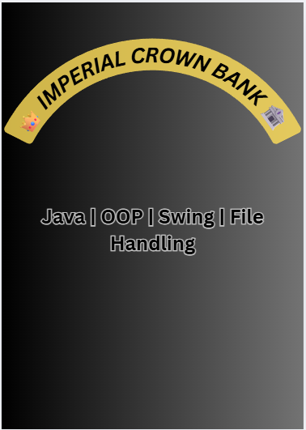

# 👑 Imperial Crown Bank

A complete **Bank Management System** built with **Java (OOP)** and a **Swing GUI**, using **file handling** for persistent storage — no external database required.

Built during my Software Engineering degree at COMSATS University Lahore, this project marks my progression from Java basics to a full desktop application with a graphical interface and persistence.

---

## ✨ Features

- Create new bank accounts with account-number generation
- Secure login with PIN entry
- Search and display account information
- Update and delete accounts
- ATM-style deposit and withdrawal, including PIN change
- Persistent storage through file handling
- Swing GUI across all screens

## 🛠 Tech Stack

- **Java** — OOP design (classes per feature: login, deposit, withdraw, search, update, delete)
- **Swing** — GUI development
- **File I/O** — persistent account records

## 🚀 How to Run

1. Clone this repository:
   ```bash
   git clone https://github.com/Ahsan-muhd-444/Imperial-Crown-Bank-java.git
   cd Imperial-Crown-Bank-java
   ```
2. Compile the sources:
   ```bash
   javac src/com/example/*.java -d out
   ```
3. Run the main menu:
   ```bash
   java -cp out com.example.LoginUser
   ```

> Requires JDK 8 or newer. Account records are created at runtime as local text files (not tracked in the repository).

## 📸 Screenshots

| Login | Create Account |
|---|---|
|  |  |

More screenshots are available in the [`Impertial Crown Bank ScreenShots`](Impertial%20Crown%20Bank%20ScreenShots) folder.

## 📂 Repository Structure

```
Imperial-Crown-Bank-java/
├── src/com/example/     # Java source files (one class per feature)
├── Impertial Crown Bank ScreenShots/   # Application screenshots
├── banner.png           # Repository banner
└── README.md
```

## ⚠️ Note on Data

Runtime data files are excluded via `.gitignore`. All account information shown in screenshots is sample data.

## 👤 Author

**Muhammad Ahsan** — [GitHub](https://github.com/Ahsan-muhd-444) · [LinkedIn](https://www.linkedin.com/in/muhammad-ahsan-4a8154364)
